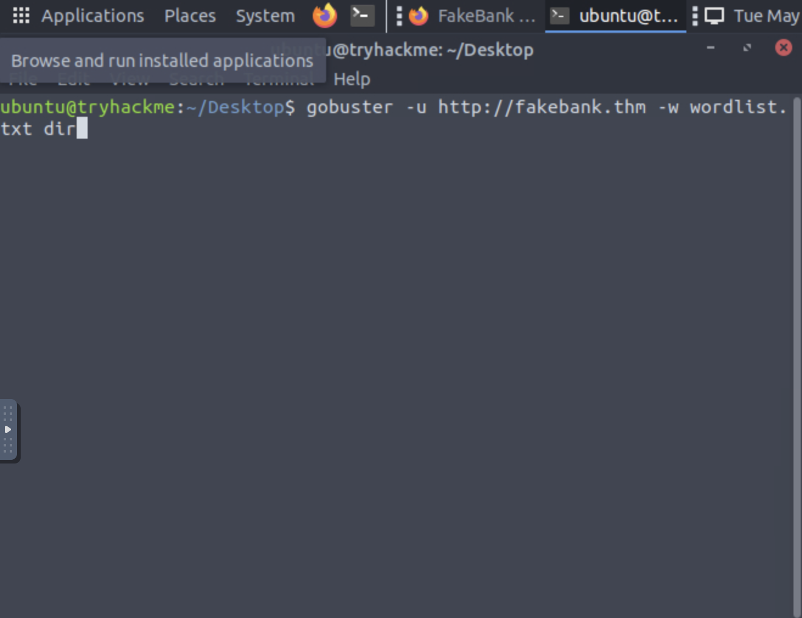
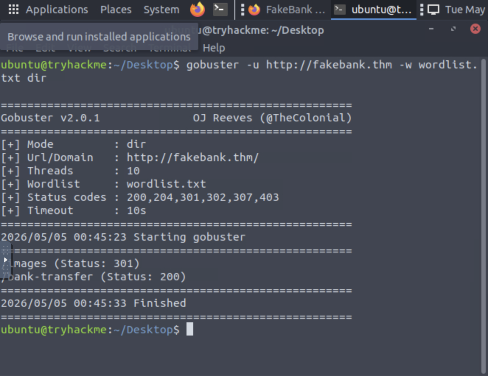
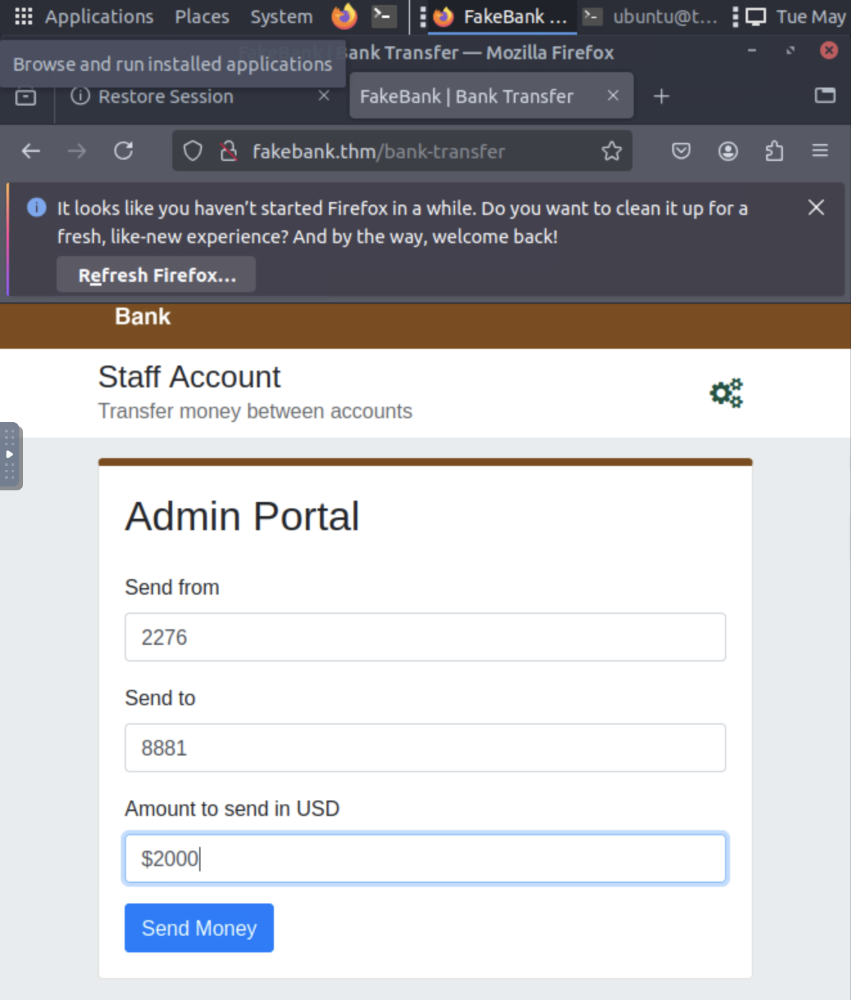
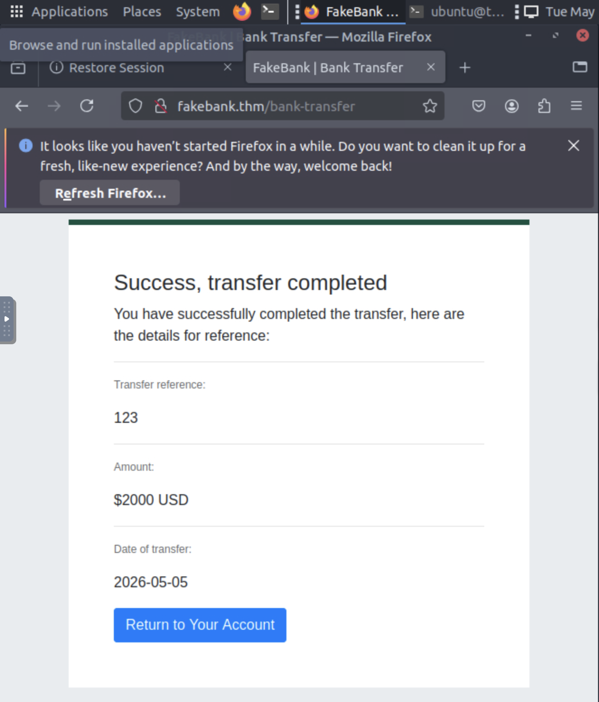
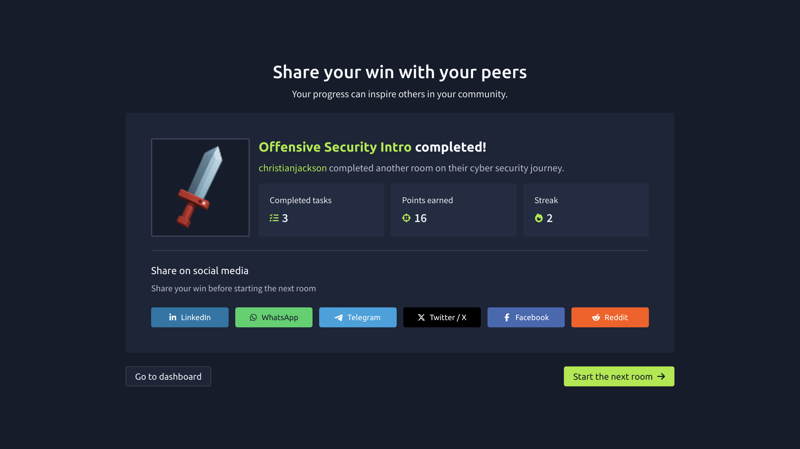

# Web Directory Enumeration & Unauthorization Access 
**Lab Environment:** TryHackMe (Offensive Security Intro)

## Objective 
Identify hidden web directiories using automated discovery tools to locate unauthorized administrative panels.

## Tools & Skills
*  **Tool:** Gobuster
*  **Wordlist:** common.txt
*  **Skill:** Web Enumeration, Broken Access Control Testing

## Methodology
1. **Reconnaissance:** Performed directory brute-forcing using Gobuster with 10 threads
2. **Discovery:** Successfully identified a hidden '/bank-transfer' directory with an HTTP 200 status code.
3. **Exploitation:** Accessed the administrative panel and performed a Proof of Concept (PoC) transfer to demonstrate the vulnerability.

## Technical Proof
### 1. Enumeration Command & Results 

### 2. Unauthorized Access & PoC Transfer 

### 3. Room Completion

